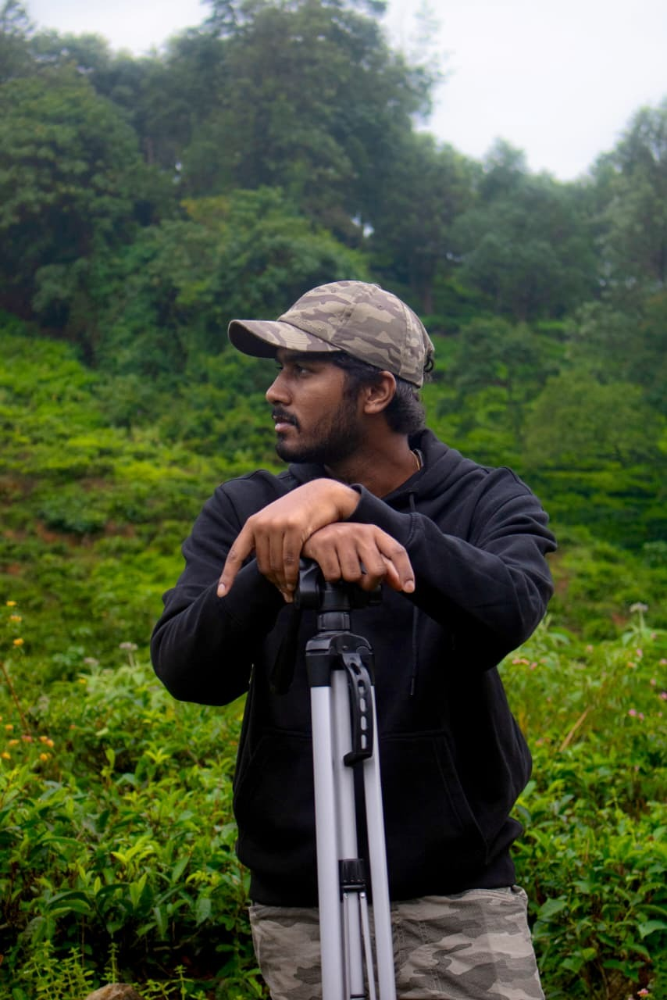

# Thanvant R — Photography Portfolio Website

A fully static, professional photography portfolio website built with pure HTML, CSS, and JavaScript. Designed for GitHub Pages hosting with zero dependencies and zero build steps.

---

## 📁 Complete Folder Structure

```
thanvant-portfolio/          ← Root of your GitHub repository
│
├── index.html               ← Homepage (hero, about, featured gallery, contact)
├── wildlife.html            ← Wildlife gallery page
├── events.html              ← Events gallery page
├── portraits.html           ← Portraits gallery page
├── macro.html               ← Macro gallery page
├── nature.html              ← Nature gallery page
├── coming-soon.html         ← Coming soon page
│
├── css/
│   └── style.css            ← Complete design system (dark theme)
│
├── js/
│   └── main.js              ← All site logic (gallery loader, lightbox, etc.)
│
└── images/
    ├── home/                ← 15 featured photos for homepage
    │   ├── home-1.jpg
    │   ├── home-2.jpg
    │   └── ... home-15.jpg
    │
    ├── wildlife/            ← Wildlife gallery (up to 50 photos)
    │   ├── wildlife-1.jpg
    │   ├── wildlife-2.jpg
    │   └── ...
    │
    ├── events/              ← Events gallery
    │   ├── events-1.jpg
    │   └── ...
    │
    ├── portraits/           ← Portraits gallery
    │   ├── portraits-1.jpg
    │   └── ...
    │
    ├── macro/               ← Macro gallery
    │   ├── macro-1.jpg
    │   └── ...
    │
    ├── nature/              ← Nature gallery
    │   ├── nature-1.jpg
    │   └── ...
    │
    └── about/               ← (Optional) Your portrait photo
        └── portrait.jpg
```

---

## 🚀 Hosting on GitHub Pages

### Step 1 — Create your GitHub repository
1. Go to [github.com](https://github.com) and sign in (or create an account).
2. Click **"New repository"**.
3. Name it: `thanvant-portfolio` (or any name you prefer).
4. Set visibility: **Public** (required for free GitHub Pages).
5. Click **"Create repository"**.

### Step 2 — Upload your files
**Option A — GitHub web interface (easiest):**
1. Open your new repository.
2. Click **"uploading an existing file"** or drag and drop.
3. Upload all website files maintaining the folder structure above.
4. Commit with message: `Initial portfolio upload`.

**Option B — Git command line:**
```bash
git init
git add .
git commit -m "Initial portfolio upload"
git remote add origin https://github.com/YOUR_USERNAME/thanvant-portfolio.git
git push -u origin main
```

### Step 3 — Enable GitHub Pages
1. In your repository, go to **Settings** → **Pages** (left sidebar).
2. Under **"Source"**, select **"Deploy from a branch"**.
3. Choose branch: **main** (or master), folder: **/ (root)**.
4. Click **Save**.
5. Wait 2–3 minutes. Your site will be live at:
   `https://YOUR_USERNAME.github.io/thanvant-portfolio/`

### Step 4 — (Optional) Custom Domain
1. Buy a domain (e.g., `thanvantr.com`) from Namecheap, GoDaddy, etc.
2. In GitHub Pages settings, enter your custom domain.
3. Add a CNAME DNS record at your domain registrar pointing to `YOUR_USERNAME.github.io`.

---

## 📸 Adding / Updating Photos

### Adding images to a gallery
1. Rename your photos following the naming convention:
   - Wildlife: `wildlife-1.jpg`, `wildlife-2.jpg`, `wildlife-3.jpg` ...
   - Events: `events-1.jpg`, `events-2.jpg` ...
   - Portraits: `portraits-1.jpg`, `portraits-2.jpg` ...
   - Macro: `macro-1.jpg`, `macro-2.jpg` ...
   - Nature: `nature-1.jpg`, `nature-2.jpg` ...
   - Homepage featured: `home-1.jpg` ... `home-15.jpg`

2. Upload them to the correct folder in your GitHub repository.

3. **Update the count in `js/main.js`** (optional but makes loading faster):
   ```javascript
   const GALLERY_COUNTS = {
     wildlife:  12,  // ← Change this to how many wildlife photos you have
     events:    8,
     portraits: 15,
     macro:     20,
     nature:    10,
     home:      15
   };
   ```
   If you leave the count as `0`, the website will auto-detect images (slightly slower on first load).

### Recommended image specs for best performance
| Use | Resolution | Max file size |
|-----|-----------|---------------|
| Gallery images | 1600×1200 px | 800 KB |
| Hero featured (home-1 to home-15) | 2000×1500 px | 1.2 MB |
| Your portrait (about/portrait.jpg) | 800×1067 px | 400 KB |

> 💡 **Tip:** Use [Squoosh](https://squoosh.app) (free, browser-based) to compress your JPEGs before uploading.

### Enabling your About photo
In `index.html`, find this comment block and replace the placeholder div:
```html
<!-- Replace the placeholder below with your photo -->
<div class="about-image-frame">
  <!-- DELETE the about-placeholder div and ADD this: -->
  
</div>
```

---

## 📧 Setting Up the Contact Form (Formspree)

1. Go to [formspree.io](https://formspree.io) and sign up for a **free** account.
2. Click **"+ New Form"**, give it a name like "Portfolio Contact".
3. Copy your **Form ID** (e.g., `xpwzvoqr`).
4. Open `index.html` and find this line:
   ```html
   action="https://formspree.io/f/YOUR_FORMSPREE_ID"
   ```
5. Replace `YOUR_FORMSPREE_ID` with your actual form ID:
   ```html
   action="https://formspree.io/f/xpwzvoqr"
   ```
6. Save and push to GitHub. Forms will now be delivered to `thanvantr@gmail.com`.

> The free Formspree plan allows 50 submissions/month. Upgrade if you need more.

---

## ✨ Customisation Guide

### Change the accent colour
In `css/style.css`, find `:root` and change `--accent`:
```css
:root {
  --accent: #c8a96e;        /* Current: warm gold */
  /* Options: */
  /* --accent: #7eb8d4;      Cool blue */
  /* --accent: #d4756a;      Warm terracotta */
  /* --accent: #8db89e;      Sage green */
}
```

### Change fonts
In both the `<head>` of each HTML file and `css/style.css`:
```css
/* Find these variables and update */
--font-display: 'Playfair Display', serif;
--font-body:    'Inter', sans-serif;
```
Browse Google Fonts at [fonts.google.com](https://fonts.google.com).

### Update photographer name / tagline
Edit the `<h1>` in the hero section of `index.html` and the `<title>` tags in each HTML file.

### Add or remove gallery genres
To add a new gallery (e.g., "Street Photography"):
1. Duplicate `wildlife.html` → rename to `street.html`
2. Update the title, description, and gallery container ID
3. Add a new entry in `GALLERY_COUNTS` in `main.js`
4. Create a new function `initStreetGallery()` following the pattern
5. Add the case in the `detectAndInitPage()` switch
6. Add navigation links in all HTML files

---

## 🔍 SEO Checklist

- [ ] Update `<meta name="description">` in each HTML file with unique descriptions
- [ ] Add `<meta property="og:image">` with a preview image URL for social sharing
- [ ] Create a `sitemap.xml` (use [xml-sitemaps.com](https://www.xml-sitemaps.com))
- [ ] Add a `robots.txt` file:
  ```
  User-agent: *
  Allow: /
  Sitemap: https://YOUR_USERNAME.github.io/thanvant-portfolio/sitemap.xml
  ```
- [ ] Register your site with [Google Search Console](https://search.google.com/search-console)

---

## 🔧 Troubleshooting

| Problem | Solution |
|---------|----------|
| Images not showing | Check file names match exactly (case-sensitive on Linux servers) |
| Gallery shows empty | Ensure images are named `wildlife-1.jpg` (not `Wildlife-1.JPG`) |
| Contact form not working | Verify Formspree ID is correct and form is verified via email |
| Site not loading on GitHub Pages | Wait 5–10 mins after enabling; check Settings → Pages for errors |
| Mobile menu not working | Ensure `js/main.js` is loading (check browser console for errors) |

---

## 💡 Suggestions for Further Improvement

1. **Google Analytics** — Add GA4 tracking code to monitor visitor behaviour
2. **WebP images** — Convert JPEGs to WebP for ~30% smaller file sizes
3. **Image thumbnails** — Create 400px-wide thumbnails for gallery grid, load full size in lightbox
4. **PWA support** — Add a `manifest.json` and service worker for offline access
5. **Print stylesheet** — Add CSS media queries for printing gallery pages
6. **Dark/Light toggle** — Add a theme toggle button with `prefers-color-scheme` support
7. **EXIF display** — Show camera/lens/settings data below lightbox images
8. **Watermarking** — Use Canvas API to add subtle watermark in lightbox view
9. **Instagram feed** — Embed your latest Instagram posts via third-party widget
10. **Blog section** — Add a simple Markdown-based blog for behind-the-scenes stories

---

*Built with ❤️ for Thanvant R — pure HTML, CSS & JavaScript.*
